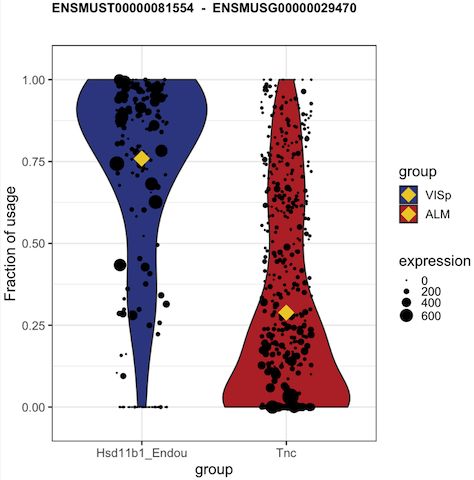
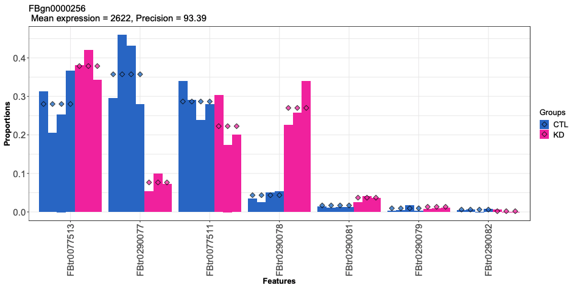
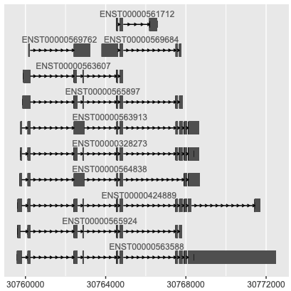

## Goal

To unlock to the [iSEE](http://bioconductor.org/packages/release/bioc/html/iSEE.html) bioconductor package for transcript-level visualization in the context single-cell omics experiments.
The idea is to have additional panels to supplement the established (gene-level) visualizations of iSEE with relevant transcript-level plots. An end-user should be able to select a gene or transcript of interest and to readily obtain relevant information at the level of the individual isoforms.

## Specific challenges

- The first obvious challenge is to come up with transcript-level visualization strategies that have an added value for end-users. Deciding on which plots are most relevant is a work in progress, but the following types have been put forward at the moment.

Visualizing the raw usage of transcript, i.e. by generating a violin plot on the fraction of the expression of a target transcript and the expression of its corresponding gene: 

Adopting/adapting the DTU visualization provided by [DRIMSeq](http://bioconductor.org/packages/release/bioc/html/DRIMSeq.html):

Visualizing gene models as provided in [ggbio](http://bioconductor.org/packages/release/bioc/html/ggbio.html). Note that this requires interaction with GRanges, which has not been implemented in iSEE yet.

- One of the main conceptual challenges will be to make the iSEEtranscripts project (and the iSEE project as a whole) as flexible as possible. Therefore, we should consider which input type is optimally suited to assure flexibility. For instance should we work with single (Ranged-)SummarizedExperiments where the transcript-level counts and gene-level counts are separate assays, or should we leverage `altExp` or `MultiAssayExperiment` to facilitate the visualization of multimodal data with iSEE.

## Structure

This project should obviously be compatible with existing bioconductor concepts, including established data types and workflows.
Therefore, we suggest the following workflow during the early stages of project;

1. Work on a single reference dataset; [macrophage](https://bioconductor.org/packages/release/data/experiment/html/macrophage.html)
2. Import data using [tximport](https://bioconductor.org/packages/release/bioc/html/tximport.html) and/or [tximeta](https://bioconductor.org/packages/release/bioc/html/tximeta.html).
3. Wrangle data in the desired object type (see specific challenges)
4. Explore different visualization strategies (see specific challenges)

## Collaborate

In order to make this a collaborative effort, we suggest forking the original iSEEtranscripts repository, working on a branch of your fork, and submitting a pull request when your contribution is ready for review.
In addition, we will use the bioc slack channel [eurobioc2020-isee-transcripts](https://community-bioc.slack.com/archives/C01HBRDBGJV) for further communication and brainstorming.

## BiocChallenges

This project is created in light of the [BiocChallenges](https://kevinrue.github.io/BiocChallenges/) project introduced at eurobioc2020.
